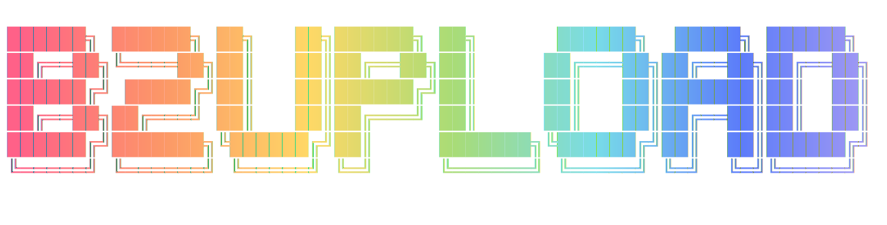

# B2Upload

  ![AOL](https://img.shields.io/badge/aol-3%20buddies%20online-fff?style=flat&logo=data:image/svg+xml;base64,PHN2ZyB4bWxucz0iaHR0cDovL3d3dy53My5vcmcvMjAwMC9zdmciIHdpZHRoPSIyMDAiIGhlaWdodD0iMjAwIiB2aWV3Qm94PSIwIDAgNDggNDgiIGZpbGw9IiNmZmZmZmYiPjxwYXRoIGZpbGw9Im5vbmUiIHN0cm9rZT0iI2ZmZmZmZiIgc3Ryb2tlLWxpbmVjYXA9InJvdW5kIiBzdHJva2UtbGluZWpvaW49InJvdW5kIiBkPSJNMTguMjA5IDQwLjg2TDQuNSA0MC44MzZsMTkuNTYtMzMuNzRsNS40ODMgOS41MzZtNS4wMDIgOC43TDQzLjUgNDAuOTA1aDBsLTE2LjQwMS0uMDNtNi45My0xNi40NGwuNTE2Ljg5N20tLjUxMy0uODk5Yy4wMDcgMi4wOTQtLjYwMiA0LjQxLTEuODYgNi41ODhoMGMtMS4yNDIgMi4xNTMtMi45OSAzLjkyMS00LjkzIDQuOTkyYy0yLjQxOSAxLjMzMy00LjkxOCAxLjQ2NS02LjgzMi4zNmMtMS4wNjItLjYxNC0xLjg2LTEuNTQ5LTIuMzgtMi42OTJjLTEuMjQtMi43MjQtLjkxMy02LjYyOCAxLjEzMy0xMC4xN2MuNDA3LS43MDcuODczLTEuMzc4IDEuMzg2LTEuOTk4bS02LjA2MSAxNS4xNDJjLTEuMjM1LTIuNzIzLS45MDYtNi42MjMgMS4xMzctMTAuMTYxYzEuMjQyLTIuMTUyIDIuOTg4LTMuOTIgNC45MjktNC45OWMyLjQxOC0xLjMzNSA0LjkxOC0xLjQ2NyA2LjgzNC0uMzYyYzEuMDYyLjYxNCAxLjg1OSAxLjU0OSAyLjM4IDIuNjkyYzEuMjQgMi43MjQuOTEyIDYuNjI4LTEuMTMzIDEwLjE3aDBhMTQuNTUzIDE0LjU1MyAwIDAgMS0xLjM5IDJtLTEyLjc0My42MzhjLTEuNDc2LTMuMDUtMS43NTMtNi45MDUtLjc2LTEwLjYwNmExNyAxNyAwIDAgMSAxLjg2OS00LjQwM20wIDBjLjA4NC0uMTM4LjE3LS4yNzQuMjU2LS40MW0wIDBjMi44ODEtNC40NDQgNy40My02LjYyNCAxMS41My01LjUyNWMuNzUzLjIwMiAxLjQ3NS41MSAyLjE1Mi45Mm00Ljk5NyA4LjcxM2MuMjIzIDIuMDA4LjA1NSA0LjExNC0uNDkgNi4xNDhoMGMtMS4xMTIgNC4xNTItMy42OTQgNy42NDQtNi45NTMgOS40MDltLTguODk4LS4wMTdjLTEuNTQ2LS45NDktMi44Mi0yLjQwNC0zLjcwMy00LjIzIi8+PC9zdmc+&label=AOL&labelColor=5B595C&color=78DCE8)   ![AI Free](https://img.shields.io/badge/ai-hand--crafted%20bugs-fff?style=flat&logo=data:image/svg+xml;base64,PHN2ZyB4bWxucz0iaHR0cDovL3d3dy53My5vcmcvMjAwMC9zdmciIHdpZHRoPSIyMDAiIGhlaWdodD0iMjAwIiB2aWV3Qm94PSIwIDAgMjQgMjQiIGZpbGw9IiNmZmZmZmYiPjxwYXRoIGZpbGw9IiNmZmZmZmYiIGQ9Ik0yMi4yODIgOS44MjFhNS45ODUgNS45ODUgMCAwIDAtLjUxNi00LjkxYTYuMDQ2IDYuMDQ2IDAgMCAwLTYuNTEtMi45QTYuMDY1IDYuMDY1IDAgMCAwIDQuOTgxIDQuMThhNS45ODUgNS45ODUgMCAwIDAtMy45OTggMi45YTYuMDQ2IDYuMDQ2IDAgMCAwIC43NDMgNy4wOTdhNS45OCA1Ljk4IDAgMCAwIC41MSA0LjkxMWE2LjA1MSA2LjA1MSAwIDAgMCA2LjUxNSAyLjlBNS45ODUgNS45ODUgMCAwIDAgMTMuMjYgMjRhNi4wNTYgNi4wNTYgMCAwIDAgNS43NzItNC4yMDZhNS45OSA1Ljk5IDAgMCAwIDMuOTk3LTIuOWE2LjA1NiA2LjA1NiAwIDAgMC0uNzQ3LTcuMDczek0xMy4yNiAyMi40M2E0LjQ3NiA0LjQ3NiAwIDAgMS0yLjg3Ni0xLjA0bC4xNDEtLjA4MWw0Ljc3OS0yLjc1OGEuNzk1Ljc5NSAwIDAgMCAuMzkyLS42ODF2LTYuNzM3bDIuMDIgMS4xNjhhLjA3MS4wNzEgMCAwIDEgLjAzOC4wNTJ2NS41ODNhNC41MDQgNC41MDQgMCAwIDEtNC40OTQgNC40OTR6TTMuNiAxOC4zMDRhNC40NyA0LjQ3IDAgMCAxLS41MzUtMy4wMTRsLjE0Mi4wODVsNC43ODMgMi43NTlhLjc3MS43NzEgMCAwIDAgLjc4IDBsNS44NDMtMy4zNjl2Mi4zMzJhLjA4LjA4IDAgMCAxLS4wMzMuMDYyTDkuNzQgMTkuOTVhNC41IDQuNSAwIDAgMS02LjE0LTEuNjQ2ek0yLjM0IDcuODk2YTQuNDg1IDQuNDg1IDAgMCAxIDIuMzY2LTEuOTczVjExLjZhLjc2Ni43NjYgMCAwIDAgLjM4OC42NzZsNS44MTUgMy4zNTVsLTIuMDIgMS4xNjhhLjA3Ni4wNzYgMCAwIDEtLjA3MSAwbC00LjgzLTIuNzg2QTQuNTA0IDQuNTA0IDAgMCAxIDIuMzQgNy44NzJ6bTE2LjU5NyAzLjg1NWwtNS44MzMtMy4zODdMMTUuMTE5IDcuMmEuMDc2LjA3NiAwIDAgMSAuMDcxIDBsNC44MyAyLjc5MWE0LjQ5NCA0LjQ5NCAwIDAgMS0uNjc2IDguMTA1di01LjY3OGEuNzkuNzkgMCAwIDAtLjQwNy0uNjY3em0yLjAxLTMuMDIzbC0uMTQxLS4wODVsLTQuNzc0LTIuNzgyYS43NzYuNzc2IDAgMCAwLS43ODUgMEw5LjQwOSA5LjIzVjYuODk3YS4wNjYuMDY2IDAgMCAxIC4wMjgtLjA2MWw0LjgzLTIuNzg3YTQuNSA0LjUgMCAwIDEgNi42OCA0LjY2em0tMTIuNjQgNC4xMzVsLTIuMDItMS4xNjRhLjA4LjA4IDAgMCAxLS4wMzgtLjA1N1Y2LjA3NWE0LjUgNC41IDAgMCAxIDcuMzc1LTMuNDUzbC0uMTQyLjA4TDguNzA0IDUuNDZhLjc5NS43OTUgMCAwIDAtLjM5My42ODF6bTEuMDk3LTIuMzY1bDIuNjAyLTEuNWwyLjYwNyAxLjV2Mi45OTlsLTIuNTk3IDEuNWwtMi42MDctMS41WiIvPjwvc3ZnPg==&logoColor=FFFFFF&label=AI%20Free&labelColor=5B595C&color=FC9867) 

<p align="center">
  
</p>

A lightweight desktop app for uploading files to Backblaze B2 via the S3-compatible API. Runs on macOS, Windows, and Linux. Built with Rust, Tauri 2, and vanilla JS.

Drop files onto the window, get shareable URLs back instantly.

## Features

- **Drag-and-drop uploads** - drop one or many files onto the window
- **Concurrent uploads** - up to 5 files upload simultaneously with per-file status
- **Two folder modes** - toggle between two independently configured folders (e.g. "private" and "shared")
- **Auto-copy** - single-file uploads are automatically copied to the clipboard
- **Upload history** - browse and copy URLs from previous uploads
- **Cancel uploads** - cancel in-progress batch uploads; in-flight files finish, remaining are skipped
- **Individual history deletion** - remove single entries from upload history
- **Settings validation** - required fields are validated before saving with visual feedback
- **Encrypted credential storage** - sensitive keys stored individually in the system keyring (macOS Keychain, Windows Credential Manager, Linux Secret Service) with automatic memory zeroization; non-sensitive config stored in a local JSON file
- **Configurable upload paths** - date folders, UUID filenames, overwrite protection, and per-folder URL tokens are all optional
- **URL encoding** - filenames with spaces and special characters are properly percent-encoded

## Settings

Open settings with the gear icon. There are three sections:

### Connection

| Field                  | Description                                                    |
| ---------------------- | -------------------------------------------------------------- |
| **Domain**             | Your public-facing domain (e.g. `media.example.com`)           |
| **Bucket Name**        | The B2 bucket name                                             |
| **S3 Endpoint**        | S3-compatible endpoint (e.g. `s3.us-east-005.backblazeb2.com`) |
| **Application Key ID** | B2 app key ID                                                  |
| **Application Key**    | B2 app key secret                                              |

All five connection fields are required before uploads will work.

### Folders

Two folders can be configured. Each has a name and an optional URL token.

| Field              | Default   | Description                                                                                    |
| ------------------ | --------- | ---------------------------------------------------------------------------------------------- |
| **Folder 1**       | `private` | Name used as the top-level prefix in the object key. Leave blank to upload to the bucket root. |
| **Folder 1 Token** | _(empty)_ | If set, appended as `?token=xxx` to the returned URL. If blank, no token is added.             |
| **Folder 2**       | `shared`  | Same as above for the second folder.                                                           |
| **Folder 2 Token** | _(empty)_ | Same as above.                                                                                 |

The toggle on the main screen switches between Folder 1 and Folder 2. The toggle labels update to match whatever names you've configured (capitalized).

### Token Mode

| Setting            | Default   | Description                                                                                                        |
| ------------------ | --------- | ------------------------------------------------------------------------------------------------------------------ |
| **Dynamic tokens** | Off       | When on, generates HMAC-SHA256 signed URLs with expiration instead of static per-folder tokens                     |
| **Token Secret**   | _(empty)_ | Shared HMAC-SHA256 secret (must match the secret configured in your Cloudflare Worker)                             |
| **Default TTL**    | 1 hour    | Default time-to-live for signed URLs. A TTL dropdown also appears on the main screen when dynamic mode is enabled. |

When dynamic mode is enabled, static token fields are hidden (values are preserved). The generated URL format is `https://domain/key?token=SIGNATURE&expires=TIMESTAMP` where the signature is HMAC-SHA256 over `/{object_key}:{expires}`, base64url-encoded without padding.

### Upload Options

| Option                | Default | Description                                                                                                                                                                                                       |
| --------------------- | ------- | ----------------------------------------------------------------------------------------------------------------------------------------------------------------------------------------------------------------- |
| **Date folders**      | On      | Inserts a `YYYY/MM/DD` path segment after the folder name                                                                                                                                                         |
| **UUID filenames**    | On      | Replaces the original filename with a random UUID. Prevents filename collisions.                                                                                                                                  |
| **Overwrite uploads** | Off     | When off and UUID filenames are also off, the app checks if the file already exists before uploading and returns an error if it does. When UUID filenames are on, this check is skipped (no collisions possible). |

### Upload Path Examples

With all defaults and Folder 1 selected:

```text
private/2026/02/20/a3f7c21e-1234-5678-abcd-ef0123456789.png
```

Date folders off:

```text
private/a3f7c21e-1234-5678-abcd-ef0123456789.png
```

UUID filenames off:

```text
private/2026/02/20/screenshot.png
```

Folder name blank, date off, UUID off:

```text
screenshot.png
```

## Using Tokens with a Cloudflare Worker

The folder tokens are designed for use with a proxy that sits between your users and Backblaze B2. Instead of exposing your B2 bucket directly, you point a custom domain at a Cloudflare Worker that checks the `?token=` parameter before serving the file. This way you can share links that only work with the right token, and have different tokens for different folders.

### How it works

1. B2Upload appends `?token=abc123` to the URL it generates
2. A user or browser requests `https://media.example.com/shared/photo.png?token=abc123`
3. Your Cloudflare Worker checks the token against the expected value for that folder path
4. If valid, the worker strips the token and fetches the file from B2
5. If invalid, the worker returns 401 Unauthorized

### Setup

1. Create a [Cloudflare Worker](https://developers.cloudflare.com/workers/) on your account
2. Set a custom route so it handles requests to your domain (e.g. `media.example.com/*`)
3. Add your tokens as environment variables in the Worker settings (e.g. `SHARED_TOKEN`, `PRIVATE_TOKEN`)
4. Deploy the worker code below
5. In B2Upload settings, enter the same token values in the Folder 1/Folder 2 Token fields

### Example Worker

#### Simple 1 token per folder

```js
export default {
    async fetch(request, env) {
        const url = new URL(request.url);
        const token = url.searchParams.get("token");
        const path = url.pathname;

        // Check token based on folder path
        let authorized = false;

        if (path.startsWith("/shared/")) {
            authorized = token === env.SHARED_TOKEN;
        } else if (path.startsWith("/private/")) {
            authorized = token === env.PRIVATE_TOKEN;
        }

        if (!authorized) {
            return new Response("Unauthorized", { status: 401 });
        }

        // Strip token before proxying to B2
        url.searchParams.delete("token");

        // Fetch from B2 - replace with your B2 download URL and bucket name
        const b2Url = `https://f000.backblazeb2.com/file/your-bucket-name${path}`;
        const response = await fetch(b2Url);

        // Return with CORS headers
        const headers = new Headers(response.headers);
        headers.set("Access-Control-Allow-Origin", "*");

        return new Response(response.body, {
            status: response.status,
            headers,
        });
    },
};
```

#### Dynamic token + expiry example [cloudflare_worker.js](src/cloudflare_worker.js)

```js
const VERSION = "1.1.2";

export default {
    async fetch(request, env) {
        const url = new URL(request.url);
        const path = url.pathname;

        if (path === "/version") {
            return new Response(VERSION);
        }

        const token = url.searchParams.get("token");
        const expires = url.searchParams.get("expires");

        if (!token || !expires) {
            return new Response("Unauthorized", { status: 401 });
        }

        // Check expiry first (expires is a Unix timestamp in seconds)
        const now = Math.floor(Date.now() / 1000);
        if (now > parseInt(expires, 10)) {
            return new Response("Link expired", { status: 403 });
        }

        // Validate token - signed over path + expires together
        const expectedToken = await generateToken(
            path,
            expires,
            env.TOKEN_SECRET,
        );

        if (token !== expectedToken) {
            return new Response("Unauthorized", { status: 401 });
        }

        // Strip params before proxying to B2
        url.searchParams.delete("token");
        url.searchParams.delete("expires");

        const b2Url = `${env.B2_ORIGIN_URL}${path}`;
        const response = await fetch(b2Url);

        const headers = new Headers(response.headers);
        headers.set("Access-Control-Allow-Origin", "*");

        return new Response(response.body, {
            status: response.status,
            headers,
        });
    },
};

async function generateToken(path, expires, secret) {
    const message = `${path}:${expires}`;
    const encoder = new TextEncoder();
    const key = await crypto.subtle.importKey(
        "raw",
        encoder.encode(secret),
        { name: "HMAC", hash: "SHA-256" },
        false,
        ["sign"],
    );
    const signature = await crypto.subtle.sign(
        "HMAC",
        key,
        encoder.encode(message),
    );
    const base64 = btoa(String.fromCharCode(...new Uint8Array(signature)));
    return base64.replace(/\+/g, "-").replace(/\//g, "_").replace(/=+$/, "");
}
```

Set the secret in Cloudflare as an environment variable called `TOKEN_SECRET`.

You can extend this to support a master token that works across all paths, multiple tokens per folder, or any other access pattern you need.

### wrangler

You can setup the variables and deploy with wrangler

```bash
# set secret(s), this will prompt you for the secret
wrangler secret put TOKEN_SECRET --name <worker-name>

# generate secret (make sure to save this somewhere lol)
SECRET=$(openssl rand -base64 32)

# set secret(s)
echo "$SECRET" | wrangler secret put TOKEN_SECRET --name media-auth

# deploy workers from wrangler.toml
wrangler deploy
```

## Tech Stack

- **Backend:** Rust + Tauri 2
- **Frontend:** Vanilla JS + CSS (no build step)
- **Storage:** AWS S3 SDK (Backblaze B2 S3-compatible API)
- **Credentials:** Split storage -- non-sensitive config in `config.json`, sensitive keys individually in system keyring via `keyring` crate with `zeroize` for automatic memory clearing
- **Async:** Tokio

## Installation

Pre-built binaries are available from the [Releases](../../releases) page for all three platforms.

| Platform | Formats               |
| -------- | --------------------- |
| macOS    | `.dmg`                |
| Windows  | `.msi`, `.exe` (NSIS) |
| Linux    | `.deb`, `.AppImage`   |

### macOS Gatekeeper

The app is not currently signed with an Apple Developer certificate. You may need to remove the quarantine attribute after installing:

```sh
xattr -cr /Applications/B2Upload.app
```

### Windows

Run the `.msi` installer or the `.exe` (NSIS) setup. No additional steps required.

### Linux

Install the `.deb` package or run the `.AppImage` directly:

```sh
# Debian/Ubuntu
sudo dpkg -i b2upload_*.deb

# AppImage
chmod +x B2Upload_*.AppImage
./B2Upload_*.AppImage
```

## Building

Requires Rust and the Tauri CLI.

```sh
cargo install tauri-cli
cargo tauri dev      # run in development
cargo tauri build    # build for current platform
```

CI/CD builds for all three platforms with targets: `dmg`, `deb`, `appimage`, `msi`, `nsis`.

## Project Structure

```text
src/
  index.html        # Single-page UI with all views
  app.js            # Frontend logic
  style.css         # Dark theme styles

src-tauri/
  src/
    main.rs         # Tauri commands and app setup
    storage.rs      # Split-tier storage (config.json + keyring), B2Credentials with zeroize, history with mutex
    uploader.rs     # S3 upload logic, path construction, percent-encoding
  tauri.conf.json   # App configuration
  Cargo.toml        # Rust dependencies
```

## License

This project is licensed under the MIT License. See the [LICENSE](LICENSE) file for details.
